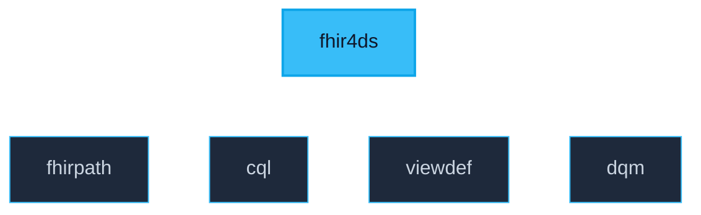

# fhir4ds

The `fhir4ds` package is the unified entry point for the toolkit. It orchestrates sub-packages to provide a seamless high-level API for FHIR data science.



## 1. At a Glance

The most common entry points are exposed directly at the package root:

```python
from fhir4ds import (
    create_connection,    # Get a pre-configured connection
    register,             # Register UDFs on an existing connection
    evaluate_measure,     # End-to-end quality measure evaluation
    generate_view_sql,    # ViewDefinition → SQL
)
```

---

## 2. Function Reference

### `create_connection`
`create_connection(database=":memory:", *, allow_unsigned_extensions=True, register_udfs=True, **kwargs) -> duckdb.DuckDBPyConnection`

The recommended way to start. Returns a DuckDB connection with all FHIRPath and CQL extensions pre-registered.

| Parameter | Type | Default | Description |
|-----------|------|---------|-------------|
| `database` | `str` | `":memory:"` | Path to the DuckDB file. |
| `allow_unsigned_extensions` | `bool` | `True` | Allow loading unsigned (dev-build) DuckDB extensions. |
| `register_udfs` | `bool` | `True` | Automatically register all UDFs on the connection. |
| `valueset_cache` | `dict` | `None` | Pre-expanded terminology map for `in_valueset`. |
| `**kwargs` | `Any` | - | Additional arguments passed to `duckdb.connect()`. |

```python
import fhir4ds
con = fhir4ds.create_connection()
```

---

### `register`
`register(con, *, valueset_cache=None) -> dict`

Prepares an existing DuckDB connection for FHIR4DS tasks. Prefers C++ extensions but falls back to Python UDFs.

| Parameter | Type | Description |
|-----------|------|-------------|
| `con` | `duckdb.DuckDBPyConnection` | The connection to prepare. |
| `valueset_cache` | `dict` | (Optional) Pre-expanded terminology map. |

**Returns**: `dict` showing which C++ extensions were successfully loaded.

---

### `evaluate_measure`
`evaluate_measure(library_path, conn, *, output_columns=None, parameters=None) -> duckdb.DuckDBPyRelation`

The primary API for quality measure evaluation. Translates CQL to SQL and executes it in one step.

| Parameter | Type | Description |
|-----------|------|-------------|
| `library_path` | `str` | Path to the CQL library file. |
| `conn` | `duckdb.DuckDBPyConnection` | The database connection. |
| `output_columns` | `dict` | (Optional) Mapping of SQL column names to CQL definition names. |
| `parameters` | `dict` | (Optional) Key-value pairs for CQL parameters (e.g. Measurement Period). |

```python
result = fhir4ds.evaluate_measure(
    "CMS165.cql", 
    con, 
    parameters={"Measurement Period": ("2025-01-01", "2025-12-31")}
)
df = result.df()
```

---

### `generate_view_sql`
`generate_view_sql(view_definition) -> str`

Generates optimized DuckDB SQL from a declarative SQL-on-FHIR v2 ViewDefinition.

| Parameter | Type | Description |
|-----------|------|-------------|
| `view_definition` | `dict | str` | The ViewDefinition JSON as a dict or string. |

```python
sql = fhir4ds.generate_view_sql(my_view_json)
df = con.execute(sql).df()
```

---

## 3. Sub-Package Access

Advanced users can access the underlying specialized modules directly:

- **`fhir4ds.fhirpath`**: Low-level expression evaluation.
- **`fhir4ds.cql`**: Advanced translator and ELM handling.
- **`fhir4ds.viewdef`**: ViewDefinition parser and AST access.
- **`fhir4ds.dqm`**: Detailed audit evidence orchestration.
