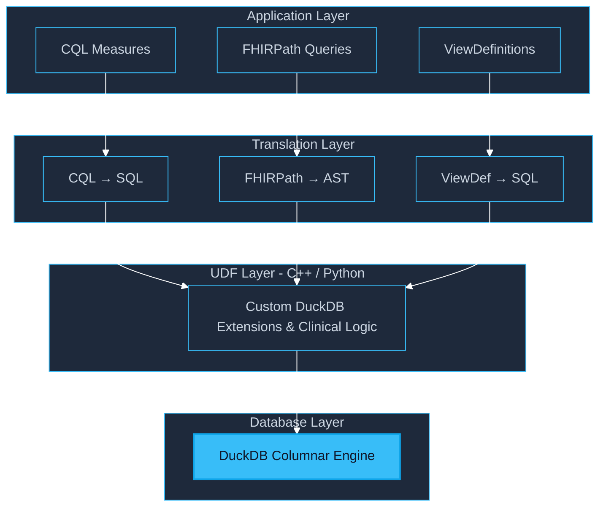

# Architecture

FHIR4DS is designed for high-performance healthcare analytics with zero infrastructure overhead. It achieves this by moving clinical reasoning logic directly into the database layer via **SQL-native translation**.

## The "SQL-Native" Paradigm

Traditional engines evaluate logic by looping through patients in a virtual machine. FHIR4DS introduces a paradigm shift by translating the entire logic tree into a single, highly optimized SQL query.

- **Transparency**: The output is standard DuckDB SQL that can be inspected, debugged, or integrated into existing data pipelines.
- **Performance**: Leveraging DuckDB's vectorized columnar engine allows FHIR4DS to process thousands of patients in milliseconds.
- **Portability**: Because the execution happens in SQL, the same logic runs identically in a Python notebook or a web browser via WebAssembly.

## System Overview

The toolkit is organized into four distinct layers, from high-level clinical authoring to low-level database execution:

## Unified Entry Point

The `fhir4ds` package serves as the primary interface, orchestrating the underlying specialized packages (`cql`, `fhirpath`, `viewdef`) into a cohesive workflow. It handles the automatic selection of high-performance C++ extensions or cross-platform Python fallbacks, ensuring that the engine "just works" in any environment.

---

:::info 

Technical Deep Dives

- For details on the C++ DuckDB extensions, see [Native DuckDB Integration](/docs/user-guide/extraction/duckdb).
- For details on the translation pipeline, see [Clinical Quality Language (CQL)](/docs/user-guide/analytics/cql).
- For details on explainable AI and auditing, see [Digital Quality Measures (DQM)](/docs/user-guide/quality/dqm).

:::
